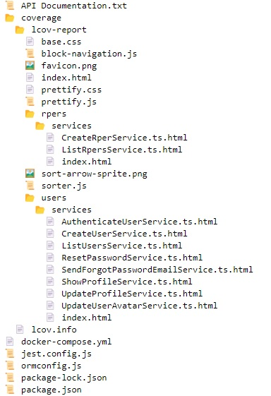

  

# 🖨️ Print GitHub Repository Structure Tree 🌲

This script fetches the structure of a GitHub repository and generates an HTML visualization with icons for different file types.

## Alternative Names

- Github Repository File System to HTML Tree Generator
- GitHub Repository File and Folder Structure Tree Generator
- Print GitHub Repository to Text
- Print GitHub Repository to PDF
- GitHub Repository File and Directory
- Visual GitHub Tree Structure Generator
- Interactive GitHub Repository Directory Mapper
- GitHub Repo Content Tree Visualization Tool
- GitHub Repository Structure Explorer
- Comprehensive GitHub Directory and File Tree Maker
- GitHub Project File Hierarchy Display Tool
- Dynamic GitHub Repo Structure Diagram Generator
- GitHub Directory Layout Visualization Software

## Image:

- Example of a GitHub Repository Structure Tree Printed to HTML
  

## Table of Contents

- [About](#-about)
- [Features](#-features)
- [Initial Setup](#%EF%B8%8F-initial-setup)
- [How to Use](#-how-to-use)
- [Requirements](#-requirements)
- [API GitHub Access Token](#-api-github-access-token)
- [Directory Structure](#-directory-structure)
- [Contribution](#-contribution)
- [License](#-license)

## 📌 About

The script interacts with the GitHub API to fetch the file and directory structure of a given repository. It then processes this structure and creates an HTML representation with icons for different file types.

## 🌟 Features

- Fetch repository structure from GitHub using the API.
- Display directories and files with appropriate icons.
- Generate an HTML file for visualization.

## ⚙️ Initial Setup

API GitHub configuration information is loaded from a `.env` file. You need to set up the following variables:

- `OWNER`
- `REPO`
- `BRANCH_SHA`
- `ACCESS_TOKEN`

🚨 **Attention**: Ensure you have the necessary permissions to access the repository and never commit your `.env` file containing sensitive access tokens.

## 🚀 How to Use

1. Configure your `.env` file with the necessary parameters.
2. Run the script. (usually "python main.py" in you project directory)
3. Open the generated `repo_structure.html` file in a browser to visualize the repository structure.
4. You can print with the default browser print option, or copy paste in a word processor, divide into multiple columns and so on.

## 🔧 Requirements

- Python 3.x
- Libraries: `requests`, `os`, `dotenv`
- A valid GitHub access token with necessary permissions.

## 🔑 API GitHub Access Token

- Creating your Token
- In your github click on your profile icon in the top right corner and go to Settings.
- In the left sidebar, click on Developer settings.
- Click on Personal access tokens.
- Click Generate new token.
- Give your token a name and select the necessary scopes. For reading repository content, the repo scope should be enough.
- Click Generate token.
- Copy the token and store it safely.
- ATTENTION: You won't be able to see it again.

## 📂 Directory Structure

- `main.py`: Contains the main logic for fetching and generating the HTML visualization.

## 🙌 Contribution

Feel free to fork the project, open issues, and provide pull requests.

## 📜 License

This project is licensed under the MIT License or your preferred license.
